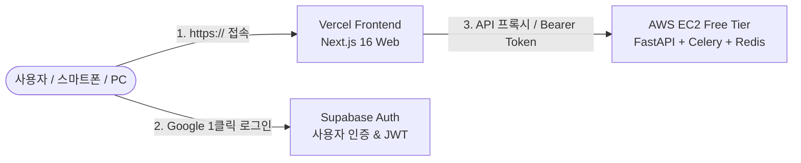

# 🚀 Vercel(웹) & AWS EC2(백엔드) 분리 배포 완전 가이드

이 문서는 **Interactive Video Study Guide System**을 **Vercel(프론트엔드)**과 **AWS EC2 Free Tier(백엔드)**로 분리 배포하고, **Supabase Auth**를 통해 안전하게 연동하는 가장 쉽고 완벽한 배포 매뉴얼입니다.

---

## 🏗️ 전체 배포 아키텍처



---

## 📌 배포 순서 안내 (추천 순서: 2번 백엔드 먼저 ➡️ 1번 프론트엔드)

> [!TIP]
> 백엔드(AWS EC2)의 퍼블릭 IP 주소를 먼저 알아야 Vercel 프론트엔드 환경변수에 `BACKEND_API_URL`을 등록할 수 있으므로, **2번(AWS EC2 백엔드)**을 먼저 올리시는 것을 추천합니다!

---

## 2️⃣ [백엔드] AWS EC2 Free Tier 배포 (5분 컷)

### 2.1 AWS EC2 인스턴스 생성
1. [AWS 콘솔](https://console.aws.amazon.com/ec2) 접속 후 **`인스턴스 시작 (Launch Instance)`** 클릭.
2. **이름**: `studyguide-backend`
3. **OS (AMI)**: **Ubuntu 24.04 LTS (x86_64)** 선택.
4. **인스턴스 유형**: **`t2.micro`** 또는 **`t3.micro`** (Free Tier 사용 가능).
5. **키 페어**: 새 키 페어 생성 또는 기존 `.pem` 키 다운로드.
6. **네트워크 설정 (보안 그룹)**:
   - `SSH` (포트 22): 내 IP
   - `사용자 지정 TCP` (포트 8000): **`0.0.0.0/0`** (FastAPI API 포트)
7. **인스턴스 시작** 클릭.

---

### 2.2 EC2 원클릭 자동 셋업
SSH 터미널로 EC2에 접속합니다:
```bash
ssh -i "내키페어.pem" ubuntu@<EC2-퍼블릭-IP>
```

접속 후 아래 명령어를 복사-붙여넣기하여 저장소 클론 및 원클릭 셋업을 실행합니다:
```bash
# 1. 저장소 클론
git clone https://github.com/your-username/Interactive-Video-Study-Guide-System.git
cd "Interactive-Video-Study-Guide-System"

# 2. 원클릭 셋업 스크립트 실행 (2GB Swap 메모리, Docker, 방화벽 자동 구성)
chmod +x scripts/*.sh
./scripts/ec2_setup.sh

# 3. Docker 권한 적용
newgrp docker
```

---

### 2.3 백엔드 환경변수 설정 및 실행
```bash
# 환경변수 파일 복사 및 편집
cp backend/.env.example backend/.env
nano backend/.env
```

`backend/.env` 파일에 발급받으신 키들을 입력합니다:
```env
APP_ENV=production
SUPABASE_JWT_SECRET=아까_복사한_Legacy_JWT_Secret
GEMINI_API_KEY=내_Gemini_API_Key
REDIS_URL=redis://redis:6379/0
CORS_ORIGINS=*
DISABLE_AUTH=false
```
*(저장: `Ctrl + O` ➡️ `Enter` / 종료: `Ctrl + X`)*

**원클릭 배포 실행:**
```bash
./scripts/deploy_backend.sh
```

**정상 작동 진단:**
```bash
python3 scripts/health_check.py
```
👉 `[PASS] Status: 200 OK`가 출력되면 백엔드가 완벽하게 기동된 것입니다!

---

## 1️⃣ [프론트엔드] Vercel 배포 (3분 컷)

### 1.1 GitHub에 코드 Push
```bash
git add .
git commit -m "feat: setup deployment configuration"
git push origin main
```

---

### 1.2 Vercel에 프로젝트 Import
1. [Vercel](https://vercel.com)에 로그인 후 **`Add New...` ➡️ `Project`** 클릭.
2. 방금 Push한 GitHub 저장소를 선택(**Import**)합니다.
3. **Root Directory**: **`Edit`** 버튼을 눌러 **`frontend`** 폴더를 선택합니다.
4. Framework Preset: **`Next.js`** 자동 감지.

---

### 1.3 Vercel 환경변수(Environment Variables) 등록
하단의 **`Environment Variables`** 섹션을 펼치고 아래 3가지를 추가합니다:

| Key (이름) | Value (값 예시) | 설명 |
| :--- | :--- | :--- |
| `NEXT_PUBLIC_SUPABASE_URL` | `https://xxxx.supabase.co` | 내 Supabase 프로젝트 URL |
| `NEXT_PUBLIC_SUPABASE_ANON_KEY` | `eyJhbGciOi...` | 내 Supabase anon public 키 |
| `BACKEND_API_URL` | `http://<EC2-퍼블릭-IP>:8000` | 방금 띄운 AWS EC2 백엔드 주소 |

5. **`Deploy`** 버튼을 클릭합니다!

---

## 3️⃣ [마무리] Supabase에 Vercel 도메인 등록

Vercel 배포가 완료되면 `https://your-project.vercel.app` 주소가 생성됩니다.

1. **Supabase 대시보드** ➡️ **`Authentication`** ➡️ **`URL Configuration`** 이동.
2. **Redirect URLs**에 생성된 Vercel 도메인을 추가합니다:
   - `https://your-project.vercel.app/auth/callback`
3. **Save** 클릭.

---

## 🎉 배포 완료 및 최종 테스트

스마트폰이나 다른 PC에서 `https://your-project.vercel.app` 주소로 접속해 보세요:
1. **Google 1클릭 로그인** 실행
2. 유튜브 URL을 넣고 **학습 가이드 생성** 실행
3. EC2 백엔드가 영상을 분석하고 실시간으로 학습서가 렌더링되는지 확인!
