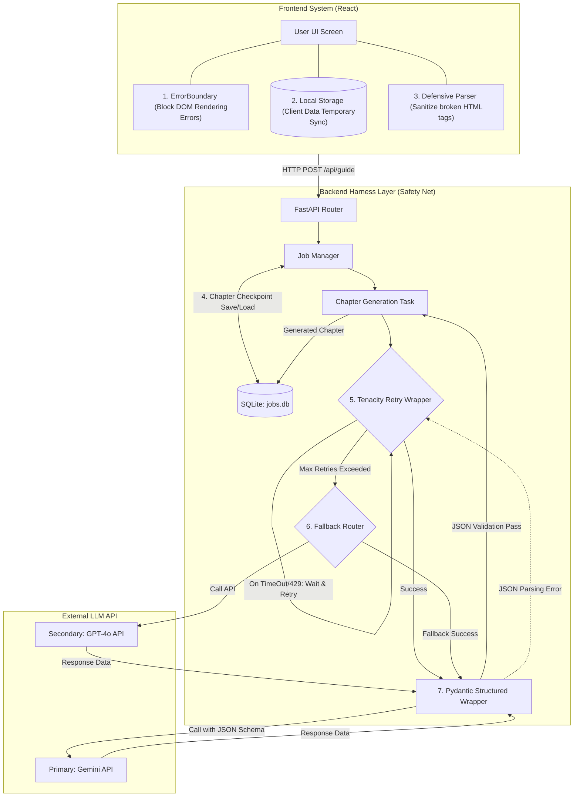

# Harness Engineering Architecture Specification
<!-- [KR] 하네스 엔지니어링 아키텍처 명세서 -->

This document outlines the Harness Engineering architecture applied to the Interactive Video Study Guide System.
<!-- [KR] 이 문서는 'Interactive Video Study Guide System' 프로젝트에 적용된 하네스 엔지니어링 아키텍처를 정의합니다. -->

## 1. Why Harness Engineering is Essential for This Project
<!-- [KR] 1. 왜 이 프로젝트에 하네스 엔지니어링이 필수적인가 -->

Unlike traditional web applications that rely on deterministic databases, this project is an AI-Native application powered by Large Language Models (LLMs). This introduces unique challenges that require structural safeguards (a "Harness").
<!-- [KR] 일반적인 웹 어플리케이션은 100% 예측 가능한 데이터베이스에 의존하지만, 이 프로젝트는 대규모 언어 모델(LLM)을 심장으로 사용하는 AI 네이티브 어플리케이션입니다. 이로 인해 다음과 같은 고유한 문제들이 발생하며, 이를 제어할 물리적 안전 장치(하네스)가 반드시 필요합니다. -->

### A. Preventing Loss of Time and Expensive API Tokens (Long-running Job Resiliency)
<!-- [KR] A. 막대한 시간과 비용(토큰)의 증발 방지 (장기 실행 작업의 복원력) -->
- **Context**: Generating a personalized study guide from a 1-hour video can take several minutes and process multiple chapters sequentially.
- **Problem**: Without a harness, a minor network blip or an API rate-limit at the 90% completion mark causes the entire job to fail. All previously generated chapters are lost, forcing the user to wait again and the developer to pay double the API token costs.
- **Solution**: Intermediate checkpointing (SQLite) saves completed chapters instantly, ensuring the process resumes exactly where it failed.
<!-- [KR] 1시간짜리 영상을 분석해 맞춤형 가이드를 만드는 데는 수 분이 걸립니다. 하네스가 없다면 90% 완성 단계에서 구글 서버가 1초 끊겼다는 이유로 모든 데이터가 날아가고, 토큰 비용을 두 번 내야 합니다. 체크포인트를 통해 중간 저장하여 이런 손실을 완벽히 방어합니다. -->

### B. Controlling Non-Deterministic AI Outputs (Structural Containment)
<!-- [KR] B. AI의 비결정적(예측 불가능한) 출력 통제 -->
- **Context**: LLMs do not always follow instructions perfectly. They may drop closing tags (e.g., `<quiz>`), output malformed JSON, or inject hallucinated text.
- **Problem**: When a traditional frontend tries to parse corrupted AI output, it results in a fatal parsing error, causing a "White Screen of Death" for the user.
- **Solution**: We enforce strict rules via Pydantic schemas at the backend network layer and apply Defensive Parsing and React ErrorBoundaries at the frontend layer to sanitize and isolate corrupted outputs.
<!-- [KR] AI는 가끔 JSON 괄호를 빼먹거나 이상한 HTML 태그를 뱉어냅니다 (예: 최근 겪었던 `<quiz>` 태그 증발 버그). 방어막이 없으면 화면 전체가 하얗게 죽어버리므로, 백엔드에서는 Pydantic으로 출력 규격을 쇠파이프처럼 강제하고 프론트엔드에서는 ErrorBoundary로 에러를 격리해야 합니다. -->

### C. Preventing User Churn via Graceful Degradation (UX Protection)
<!-- [KR] C. '고장 난 앱'이라는 오해 방지 (UX 보호) -->
- **Context**: LLM APIs often experience high latency or temporary outages.
- **Problem**: A user staring at an infinite loading spinner will assume the app is broken and leave forever.
- **Solution**: Fallback model routing automatically switches to a backup AI without notifying the user, and client-side caching ensures UI state is instantly restored on page refresh.
<!-- [KR] 외부 요인으로 장애가 났을 때, 사용자가 무한 로딩만 보게 되면 이탈합니다. 보조 AI 모델(Fallback)로 몰래 우회하거나, 로컬 캐시를 보여주어 사용자가 장애를 전혀 눈치채지 못하고 '항상 쾌적하고 튼튼한 앱'으로 느끼게 만들어야 합니다. -->

## 2. System Architecture Diagram
<!-- [KR] 2. 시스템 아키텍처 다이어그램 -->

The following diagram illustrates the data flow and where the Harness filters are structurally positioned to intercept failures.
<!-- [KR] 아래 다이어그램은 데이터의 흐름과, 에러를 차단하기 위해 하네스(거름망) 필터가 구조적으로 어디에 위치하는지 보여줍니다. -->

## 3. Technical Specifications
<!-- [KR] 3. 상세 기술 명세 -->

### Frontend Harness Layer
<!-- [KR] 프론트엔드 하네스 계층 -->

* **1. React ErrorBoundary (Rendering Shield)**
  * Blocks component tree crashes when parsing corrupted markdown. Isolates the error to a single chapter block rather than crashing the entire application.
  * <!-- [KR] 리액트 컴포넌트 트리에서 마크다운 파싱 에러가 발생했을 때 부모로 에러가 전파되는 것을 막아, 특정 챕터만 깨지고 전체 화면은 정상 작동하도록 격리(Isolation)합니다. -->
* **2. Local Storage Caching (Zero-Backend State Sync)**
  * Synchronizes fetched JSON results to `localStorage`. Prevents expensive API re-fetches when users refresh the page or navigate backwards.
  * <!-- [KR] 받아온 결과물 데이터를 브라우저 로컬 스토리지에 동기화하여, 사용자가 새로고침을 하더라도 백엔드를 다시 호출(토큰 소모)하지 않고 즉시 화면을 복원합니다. -->
* **3. Defensive Parsing**
  * Uses RegEx and string sanitization utilities to forcefully close unclosed HTML tags (e.g., `<quiz>`) before they are injected into the React DOM.
  * <!-- [KR] 백엔드에서 넘어온 텍스트에 정규식을 돌려, 닫히지 않은 HTML 태그나 손상된 문자열이 DOM에 직접 삽입되기 전에 강제로 정제(Sanitize)합니다. -->

### Backend Harness Layer
<!-- [KR] 백엔드 하네스 계층 -->

* **4. SQLite Checkpointing**
  * Saves state into `jobs.db` immediately after each chapter generates. Allows seamless resumption of dropped jobs to save tokens.
  * <!-- [KR] 10개의 챕터 중 1개가 완성될 때마다 메모리에 두지 않고 즉시 DB에 저장합니다. 서버가 죽어도 재가동 시 완성된 챕터는 API 호출을 스킵합니다. -->
* **5. Tenacity Retry Wrapper**
  * Wraps LLM API calls with `@retry`. Automatically catches 503/429 HTTP errors and resends the request with exponential backoff (2s, 4s, 8s).
  * <!-- [KR] LLM 호출 함수 외부에 데코레이터를 부착하여, 503(서버 오류)이나 429(속도 제한) 에러 시 앱이 죽지 않고 2초, 4초 대기 후 자동으로 재호출하게 만듭니다. -->
* **6. Fallback Router**
  * If the primary model (Gemini) exhausts all retry attempts, a `try-except` block intercepts the failure and reroutes the identical prompt to a secondary model (GPT-4o).
  * <!-- [KR] 메인 모델이 여러 번 재시도해도 응답하지 않으면, 에러를 내는 대신 보조 모델(OpenAI 등)로 몰래 우회 전송하는 안전장치입니다. -->
* **7. Pydantic Structured Output**
  * Injects rigid JSON schemas into the API request protocol. Throws `ValidationError` on mismatched keys or types, forcing the LLM to conform to application logic.
  * <!-- [KR] API 요청 시 Pydantic으로 정의된 JSON 스키마를 함께 던져서, AI가 규격에 안 맞는 데이터를 주면 파싱 에러를 내고 강제로 다시 대답하게 만들어(Tenacity 연결) 엉뚱한 문자열의 유입을 원천 차단합니다. -->
