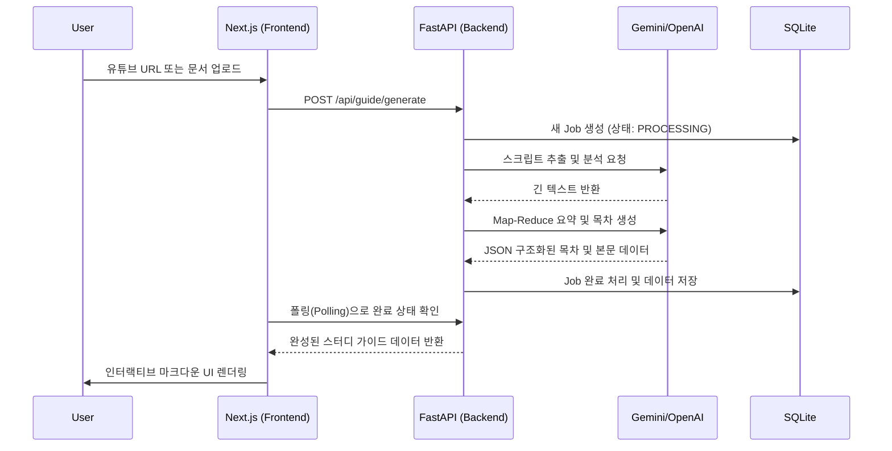
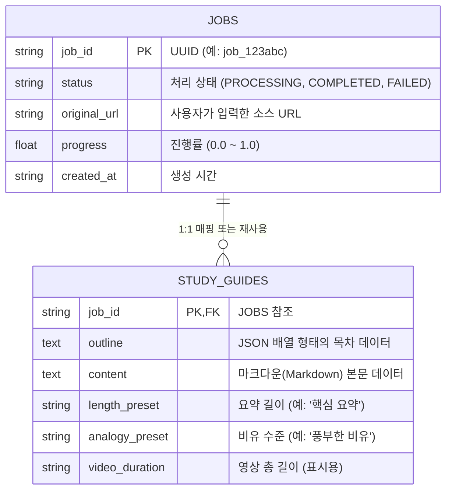

# 시스템 아키텍처 및 데이터베이스

## 1. 시스템 전체 흐름도 (Architecture Overview)
StudyGuide.AI는 Next.js(프론트엔드)와 FastAPI(백엔드)가 결합된 모던 웹 애플리케이션입니다. 사용자 요청은 백엔드의 LLM 파이프라인을 거쳐 정제된 마크다운 데이터로 반환됩니다.

## 2. 백엔드 처리 파이프라인 (The Generation Pipeline)
텍스트가 길어지면 LLM이 문맥을 놓치거나 환각(Hallucination) 현상을 일으키는 것을 막기 위해, 백엔드는 다음과 같은 다단계 파이프라인을 거칩니다.

1. **추출 (Extraction)**: `youtube-transcript-api`를 통한 자막 추출 또는 오디오 분할(Chunking) 후 Whisper/Gemini 멀티모달 분석.
2. **요약 (Map-Reduce)**: 텍스트가 2만 자를 초과할 경우, 5천 자 단위로 잘게 쪼개어 병렬(asyncio.gather)로 1차 요약을 진행한 뒤 하나로 병합.
3. **구조화 (Outline)**: 병합된 마스터 텍스트를 바탕으로 적절한 분량의 목차(챕터)를 기획.
4. **본문 작성 (Detailing)**: 기획된 목차마다 별도의 LLM 프롬프트를 병렬로 던져, 학습자 수준(Persona)에 맞는 맞춤형 해설과 비유를 작성.

## 3. 데이터베이스 스키마 (SQLite ERD)
핵심 상태와 데이터를 영속적으로 저장하기 위해 SQLite를 사용합니다.

